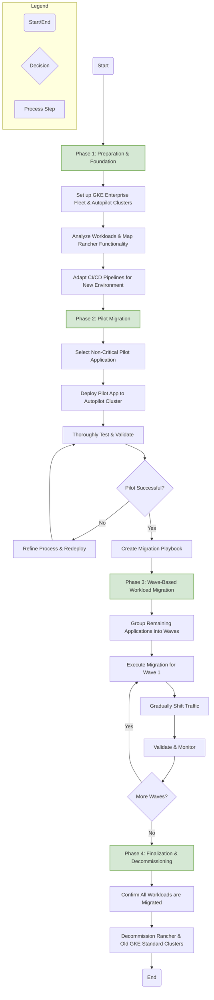

Excellent. Let's proceed with the migration process itself, starting with a high-level overview before diving into the detailed steps.

***

## Migration Process Overview

The migration will be conducted in a structured, phased approach to minimize risk, ensure a smooth transition, and allow for continuous learning throughout the process. The strategy is to build the new GKE Enterprise foundation, conduct a pilot migration with a representative application to validate the process, and then proceed with migrating the remaining workloads in logical, manageable waves.

### **Phase 1: Preparation & Foundation**
**(Estimated Duration: 1-2 Weeks)**
The goal of this phase is to build the target GKE Enterprise environment and prepare all necessary tooling and processes. This involves setting up the core infrastructure, analyzing the existing application landscape, and adapting deployment pipelines. This foundational work is critical for a smooth execution of subsequent phases.

### **Phase 2: Pilot Migration**
**(Estimated Duration: 2-3 Weeks)**
In this phase, we will migrate a single, non-critical but representative application to the new environment. The primary objective is to test and validate the entire end-to-end migration process, from CI/CD deployment to operational monitoring. The learnings from this phase will be used to create a detailed "migration playbook" that will serve as the template for migrating all other workloads.

### **Phase 3: Wave-Based Workload Migration**
**(Estimated Duration: Ongoing, depends on number of applications)**
With a validated playbook in hand, we will proceed with migrating the remaining applications. Workloads will be grouped into logical "waves" based on business criticality, technical complexity, and inter-dependencies. Each wave will be migrated, validated, and fully transitioned before moving to the next, ensuring a controlled and predictable process.

### **Phase 4: Finalization & Decommissioning**
**(Estimated Duration: 1 Week)**
Once all workloads have been successfully migrated and validated in the new GKE Enterprise environment, and all production traffic is being served from the Autopilot clusters, this final phase involves the careful decommissioning of the old infrastructure. This includes shutting down the GKE Standard clusters for workloads and, finally, the Rancher management cluster, leading to the realization of the operational and cost benefits outlined previously.
