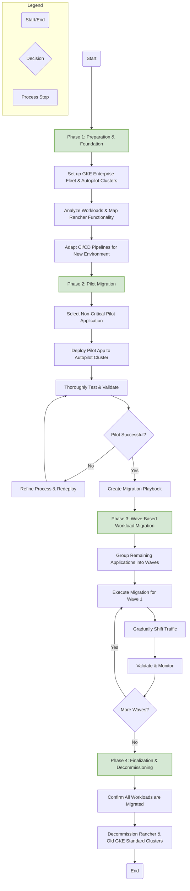
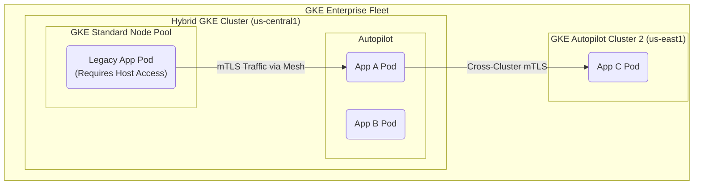

Migrating from a self-managed GKE Standard environment augmented with Rancher to a fully managed GKE Enterprise Autopilot platform with Cloud Service Mesh represents a significant leap in modernizing your Kubernetes operations. This strategic move shifts your focus from infrastructure management to application innovation, while optimizing resource utilization and enhancing security.

Here is a comprehensive strategy to guide you through this transition, outlining the process, benefits, and key considerations.

### Understanding the Shift: A Tale of Two Architectures

First, it's crucial to understand the fundamental differences between your current and target environments:

| **Aspect** | **GKE Standard + Rancher** | **GKE Enterprise Autopilot + Cloud Service Mesh** |
| --- | --- | --- |
| **Node Management** | You are responsible for provisioning, configuring, scaling, and upgrading worker nodes. | Google manages the entire cluster infrastructure, including the control plane and worker nodes. |
| **Cluster Management** | Rancher provides a multi-cluster management interface. | GKE Enterprise provides a unified fleet management experience across multiple clusters, including those on other clouds. |
| **Resource Utilization** | Dependent on your manual configuration and cluster autoscaler settings, often leading to over-provisioning. | Autopilot automatically scales the quantity and size of nodes based on pod resource requests, leading to more efficient resource usage. |
| **Security** | You are responsible for implementing and maintaining security best practices. | Autopilot clusters have a hardened configuration by default, with automatic security patching. GKE Enterprise adds advanced security features like policy enforcement and vulnerability scanning. |
| **Service Mesh** | Requires a separate, self-managed service mesh installation. | Cloud Service Mesh is a fully managed Istio-based service that simplifies traffic management, observability, and security. |
| **Cost Model** | You pay for the underlying Compute Engine instances, regardless of utilization. | You are billed per-pod for vCPU, memory, and disk requests, which can be more cost-effective for workloads with fluctuating demand. |

### Key Benefits of the Migration

This migration offers a multitude of advantages that will positively impact your operations and bottom line:

*   **Reduced Operational Overhead**: By offloading node and cluster management to Google, your team can focus on application development and deployment rather than infrastructure maintenance.
*   **Optimal Infrastructure Utilization and Cost Savings**: GKE Autopilot's "pay-for-what-you-use" model at the pod level eliminates the need for capacity planning and reduces costs associated with underutilized nodes. Autopilot dynamically provisions resources to match workload requirements, improving efficiency.
*   **Enhanced Security Posture**: GKE Autopilot clusters come with security best practices built-in. GKE Enterprise further strengthens security with features for policy management and vulnerability scanning. Cloud Service Mesh adds a layer of security through mutual TLS (mTLS) for service-to-service communication.
*   **Improved Developer Velocity**: A fully managed platform with integrated tools for service management and observability empowers developers to build and release applications faster and more securely.
*   **Unified Multi-Cluster Management**: GKE Enterprise provides a consistent and centralized way to manage, govern, and secure your Kubernetes clusters, regardless of where they are running.
*   **Advanced Traffic Management and Observability**: Cloud Service Mesh offers sophisticated traffic routing, load balancing, and detailed telemetry, providing deep insights into your microservices architecture.

### The Migration Strategy: A Phased Approach

A successful migration requires careful planning and execution. Here’s a recommended phased approach:

**Phase 1: Discovery and Assessment (1-2 Weeks)**

1.  **Application and Workload Analysis**:
    *   Identify all applications and services running in your GKE Standard clusters.
    *   Document their resource requirements, dependencies, and any specific configurations tied to Rancher.
    *   Assess application compatibility with GKE Autopilot's constraints (e.g., no DaemonSets with host privileges).

2.  **Rancher Functionality Mapping**:
    *   List all the ways you currently use Rancher (e.g., cluster provisioning, application catalog, user authentication, monitoring).
    *   Map these functionalities to their equivalents in GKE Enterprise and Google Cloud's native tooling (see the section below for a detailed mapping).

3.  **Proof of Concept (PoC) Environment Setup**:
    *   Create a new GKE Enterprise Autopilot cluster with Cloud Service Mesh enabled.
    *   Familiarize your team with the new environment and its management tools.

**Phase 2: Pilot Migration (2-4 Weeks)**

1.  **Select a Pilot Application**:
    *   Choose a non-critical but representative application for the initial migration.
    *   This will help you validate the migration process and identify potential challenges.

2.  **CI/CD Pipeline Adaptation**:
    *   Update your CI/CD pipelines to deploy the pilot application to the new GKE Autopilot cluster.
    *   This may involve changes to your deployment manifests and scripts.

3.  **Deploy and Test**:
    *   Deploy the pilot application to the Autopilot cluster.
    *   Thoroughly test its functionality, performance, and integration with Cloud Service Mesh.
    *   Validate observability with Cloud Monitoring and Cloud Logging.

4.  **Develop Migration Playbook**:
    *   Document the entire process, including any challenges encountered and their resolutions.
    *   This playbook will serve as a guide for migrating the rest of your workloads.

**Phase 3: Wave-Based Migration (Ongoing)**

1.  **Group Applications into Migration Waves**:
    *   Categorize your applications based on their complexity, criticality, and dependencies.
    *   Plan to migrate applications in waves, starting with less critical and simpler ones.

2.  **Execute Migration Waves**:
    *   For each wave, follow the steps defined in your migration playbook.
    *   Consider a "lift and shift" approach for simpler applications and a "refactor" approach for more complex ones to fully leverage the new platform's capabilities.

3.  **Traffic Shifting and Validation**:
    *   Use Cloud Service Mesh's traffic management capabilities to gradually shift traffic from the old environment to the new one.
    *   Monitor application performance and user experience closely during the transition.

**Phase 4: Decommissioning (Final Stage)**

1.  **Verify Migration Completion**:
    *   Ensure all workloads are running successfully in the new environment and that traffic is fully routed to the GKE Autopilot clusters.

2.  **Decommission Old Infrastructure**:
    *   Once you are confident in the new environment, you can begin decommissioning the old GKE Standard clusters and the Rancher management cluster.

### Replacing Rancher's Functionality

Here's how Rancher's key features map to the GKE Enterprise and Google Cloud ecosystem:

| **Rancher Functionality** | **GKE Enterprise / Google Cloud Equivalent** |
| --- | --- |
| **Cluster Provisioning & Management** | GKE Enterprise Fleet Management, Google Cloud Console, gcloud CLI |
| **Unified UI for Multiple Clusters** | Google Cloud Console's GKE Enterprise view |
| **Application Catalog (Helm)** | Artifact Registry for Helm charts, Config Controller for GitOps |
| **Authentication & RBAC** | Identity and Access Management (IAM), GKE Enterprise security features |
| **Monitoring & Alerting** | Cloud Monitoring, Cloud Logging, GKE Enterprise security posture dashboard |
| **CI/CD Integration** | Cloud Build, integration with other popular CI/CD tools |
| **Service Mesh / Ingress** | Cloud Service Mesh, GKE Gateway controller |

### Insights and Potential Challenges

*   **Application Compatibility**: While most Kubernetes workloads run on Autopilot, there are some restrictions. Carefully review the Autopilot documentation for any limitations that might affect your applications.
*   **Learning Curve**: Your team will need to adapt to new tools and workflows. Invest in training and allow time for them to become proficient with GKE Enterprise and Cloud Service Mesh.
*   **Resource Request Tuning**: Autopilot relies on accurate resource requests in your pod specifications. You may need to profile your applications to set these values appropriately for optimal performance and cost-efficiency.
*   **Stateful Workloads**: Migrating stateful applications requires careful planning for data migration. Tools like Velero can be helpful for backing up and restoring persistent volumes.
*   **Cultural Shift**: This migration is not just a technology change; it's a shift towards a more automated and managed approach to Kubernetes. Encourage a DevOps mindset and a focus on application-level concerns.

By following this strategic approach, you can successfully migrate from your GKE Standard and Rancher setup to a more efficient, secure, and scalable platform with GKE Enterprise Autopilot and Cloud Service Mesh. This will empower your teams to innovate faster while leveraging the best of Google's managed Kubernetes services.

let's create a detailed guide, consider key GKE Enterprise features like Service Mesh, Fleet Management and Configuration Management, Binary Authorization, Autoscaling, etc.

Consider 3 clusters, each with 3 nodes each:
- Cluster 1 - Spot VMS, 3nodes - each 4vCPUsx8GB RAM
- Cluster 2- VMS, 3nodes - each 4vCPUsx8GB RAM
- Cluster 3- VMS, 3nodes - each 4vCPUsx8GB RAM <-- Rancher, this will be eliminated once GKE Ent is implemented.

The guide must include:

- Introduction
-- Audience
-- Scope
- Migration Process Objectives and Benefits
-- Overview
-- Side to side GKE + Rancher vs GKE Enterprise Autopilot + Cloud Service Mesh
-- Price comparison.
- Proposed GKE Architecture
-- Functional Components of GKE Enterprise Autopilot
--- [List of GKE Enterprise components, each with description and links to official documenation]
-- Migration Process Overview
-- Migration Prep
-- Detailed Migration Plan
-- Alternatives and Fallbacks
- Recommendations and next steps.

Instructions
- Take 1 turn per section
- Include mermaid Diagrams
- Make sure detailed steps are provided
- Always include references (in plain text) to Google Cloud's official docs, so reader can go deeper if needed

**Introduction**.

***

## GKE Enterprise Autopilot Migration Guide: From GKE Standard with Rancher

### Introduction

This document provides a comprehensive strategy and step-by-step guidance for migrating from a self-managed GKE Standard environment, managed by Rancher, to a fully-managed GKE Enterprise environment running on Autopilot clusters with Cloud Service Mesh. This transition represents a strategic move towards a more secure, efficient, and operationally streamlined Kubernetes platform, allowing your organization to focus on application innovation rather than infrastructure management.

#### **Audience**

This guide is intended for technical stakeholders responsible for planning, executing, and managing the Kubernetes platform. The primary audience includes:

*   **Cloud Architects:** Responsible for designing and overseeing the cloud infrastructure and migration strategy.
*   **Platform Engineers & DevOps Teams:** Responsible for the day-to-day management of the Kubernetes platform, CI/CD pipelines, and the execution of the migration plan.
*   **IT Managers & Decision Makers:** Responsible for understanding the business drivers, benefits, and overall process of the migration to make informed decisions.

A foundational understanding of Google Kubernetes Engine (GKE), general Kubernetes concepts, and basic networking is assumed. Familiarity with Rancher is beneficial but not required.

#### **Scope**

**In Scope:**

*   A detailed, phased migration plan for transitioning workloads from existing GKE Standard clusters to new GKE Enterprise Autopilot clusters.
*   A comprehensive overview of GKE Enterprise features, including Fleet Management, Cloud Service Mesh, Config Management, and Binary Authorization, and how they replace and enhance the functionalities previously provided by Rancher.
*   Architectural diagrams and descriptions of the proposed target state.
*   Considerations for CI/CD pipeline adjustments, observability, and security.
*   A conceptual cost comparison between the current and proposed architectures.
*   Guidance on pre-migration preparation and post-migration validation.

**Out of Scope:**

*   Detailed application code refactoring. The guide assumes applications are containerized and generally compatible with Kubernetes.
*   In-depth tutorials on every GKE Enterprise feature. This guide will provide high-level descriptions and links to official documentation for deeper dives.
*   Specific data migration strategies for stateful applications. While the guide will highlight considerations, the exact implementation will depend on the specific database or storage technology used.
*   Configuration of third-party tools not directly related to the GKE platform itself.

***

## Migration Process Objectives and Benefits

### Overview

The primary objective of this migration is to evolve from a partially self-managed Kubernetes infrastructure to a fully-managed, intelligent, and secure platform. This strategic shift aims to reduce operational overhead, optimize infrastructure costs, and enhance the security and observability of applications running on Kubernetes. By leveraging GKE Enterprise and the Autopilot mode of operation, your team can divest from infrastructure-centric tasks and focus on core business value: developing and deploying applications.

The migration is designed to achieve the following key outcomes:
*   **Decommission Rancher:** Successfully replace all functionalities provided by the Rancher management plane with equivalent or superior features within the GKE Enterprise platform.
*   **Improve Resource Efficiency:** Move from a fixed-capacity, node-based model to a dynamic, pod-based resource model with Autopilot, paying only for the resources your workloads request.
*   **Strengthen Security Posture:** Implement a multi-layered security strategy using GKE Enterprise's built-in features like Binary Authorization and security posture dashboards.
*   **Simplify Operations:** Automate cluster operations, including node provisioning, scaling, and upgrades, reducing the manual effort required from the platform team.

### Side-by-Side Comparison: GKE Standard + Rancher vs. GKE Enterprise Autopilot

The following table contrasts the current operational model with the proposed GKE Enterprise Autopilot model.

| Feature Area | Current: GKE Standard + Rancher | Proposed: GKE Enterprise Autopilot + Cloud Service Mesh |
| :--- | :--- | :--- |
| **Node Management** | **Manual:** You provision, scale, and upgrade worker nodes. Requires capacity planning. | **Fully Managed:** Google manages all nodes. No need to manage or even think about nodes. |
| **Resource Billing** | **Per-Node:** Billed for the entire VM instance (e.g., `e2-standard-4`) 24/7, regardless of pod utilization. | **Per-Pod:** Billed only for the CPU, memory, and storage resources requested by your pods. |
| **Cluster Management**| **Rancher UI:** Centralized management via a self-hosted Rancher instance running on a dedicated cluster. | **Fleet Management:** Native, centralized management via the Google Cloud Console for all registered clusters. |
| **Configuration** | **Manual/Rancher Tools:** Configuration applied manually per-cluster or via Rancher's tooling. | **Config Management:** GitOps-based, automated policy and configuration sync across the entire fleet. |
| **Service Mesh** | **Self-Installed:** Requires manual installation and lifecycle management of a service mesh like Istio. | **Cloud Service Mesh:** Fully-managed, Google-supported Istio distribution with seamless integration. |
| **Security Policy** | **Ad-hoc:** Security policies (e.g., Pod Security Policies) managed per cluster. | **Centralized Policy:** Enforce policies like Binary Authorization consistently across the fleet. |
| **Operational Overhead**| **High:** Manage Rancher server lifecycle, node pools, OS upgrades, and capacity planning. | **Low:** Focus on applications. Google handles infrastructure, patches, and scaling. |

### Price Comparison

The following price comparison provides an estimate based on a reference architecture. It is designed to illustrate the financial model shift and potential cost savings.

**Disclaimer:** These are reference prices based on on-demand rates in the `us-central1` region as of late 2025. Prices are subject to change. **You must perform a detailed analysis with your specific workload resource requests and negotiated pricing to get an accurate quote.**

#### **Reference Architecture Assumptions:**

*   **Current Architecture:**
    *   Workload Clusters: 2 GKE Standard clusters, each with 3 `e2-standard-4` nodes (4 vCPU, 16 GB RAM). Total: 6 nodes.
    *   Rancher Cluster: 1 GKE Standard cluster with 3 `e2-standard-4` nodes. Total: 3 nodes.
    *   Total Nodes: 9 `e2-standard-4` nodes.
*   **Proposed Architecture:**
    *   Workloads running on GKE Enterprise Autopilot clusters.
    *   We assume the current 6 workload nodes (24 vCPUs, 96 GB RAM total) have an average utilization of **60%**. Therefore, the total requested resources for Autopilot are estimated to be **14.4 vCPUs** and **57.6 GB RAM**.
*   **Pricing (On-Demand, us-central1):**
    *   `e2-standard-4` VM: ~$0.134/hour
    *   GKE Standard Cluster Fee: $0.10/hour/cluster
    *   GKE Autopilot vCPU: ~$0.0445/hour
    *   GKE Autopilot Memory: ~$0.0049/GB/hour
    *   GKE Enterprise Fee: $0.00834/vCPU/hour

#### **Estimated Monthly Cost Breakdown**

| Cost Component | Current Architecture (GKE Standard + Rancher) | Proposed Architecture (GKE Enterprise Autopilot) | Calculation Formula / Notes |
| :--- | :--- | :--- | :--- |
| **Base Compute Costs** | | | *Based on 730 hours/month* |
| Rancher Mgmt Cluster VMs | ~$293 | **$0** | `3 nodes * $0.134/hr * 730 hrs` (Savings) |
| Workload Cluster VMs | ~$587 | **N/A** | `6 nodes * $0.134/hr * 730 hrs` |
| Autopilot Pod Resources | N/A | ~$914 | `(14.4 vCPU * $0.0445/hr + 57.6 GB * $0.0049/hr) * 730 hrs` |
| **Management & Enterprise Fees** | | | |
| GKE Standard Cluster Fees | ~$219 | **$0** | `3 clusters * $0.10/hr * 730 hrs` (Autopilot includes this) |
| **GKE Enterprise Fee (The "Prime")** | $0 | **~$88** | `14.4 vCPU * $0.00834/hr * 730 hrs` (Cost for advanced features) |
| **Total Estimated Monthly Cost** | **~$1,099** | **~$1,002** | *Sum of components* |

#### **Summary of Financial Impact**

As the table illustrates, even with the added GKE Enterprise fee (the "prime" you pay for advanced features), the proposed architecture is estimated to be **more cost-effective**.

The primary drivers for this cost optimization are:
1.  **Elimination of the Rancher Cluster:** You immediately save **~$293/month** by decommissioning the dedicated infrastructure required to run the Rancher management plane.
2.  **Pay-for-Use Efficiency:** The Autopilot model bills for the resources your pods *request*, not the full capacity of underlying VMs. This eliminates the cost of idle resources, which is a significant factor in traditional node-based setups.

In this scenario, the **$88/month** GKE Enterprise fee is more than offset by the **$293/month** savings from the Rancher cluster alone, before even accounting for the efficiency gains of Autopilot. You gain access to a powerful suite of enterprise-grade features while potentially reducing your overall monthly bill.


Of course. Here is the next section of the guide, detailing the proposed architecture and its core components.

***

## Proposed GKE Architecture

The proposed architecture is centered around a GKE Enterprise-enabled Fleet, which provides a unified control plane for managing multiple GKE clusters. Your workloads will run on GKE Autopilot clusters, which abstract away node management and optimize resource consumption. Cloud Service Mesh will be layered on top to provide uniform observability, security, and traffic control for your microservices.

```mermaid
graph TD
    subgraph Google Cloud Platform
        subgraph GKE Enterprise Fleet ("fleet.gcloud.project")
            direction LR
            subgraph "GKE Autopilot Cluster 1 (us-central1)"
                direction TB
                App1_Pod1("App A<br/>Pod 1")
                App1_Pod2("App A<br/>Pod 2")
                App2_Pod1("App B<br/>Pod 1")
            end
            subgraph "GKE Autopilot Cluster 2 (us-east1)"
                direction TB
                App3_Pod1("App C<br/>Pod 1")
                App3_Pod2("App C<br/>Pod 2")
            end
        end

        subgraph "Centralized Control & Policy"
            GitRepo["Git Repository<br/>(Cloud Source Repositories)"]
            ConfigMgmt["Config Management"]
            PolicyController["Policy Controller"]
            BinAuth["Binary Authorization"]
        end

        subgraph "Observability & Registry"
            CSM["Cloud Service Mesh<br/>(Control Plane)"]
            Monitoring["Cloud Monitoring"]
            Logging["Cloud Logging"]
            ArtifactRegistry["Artifact Registry<br/>(Container Images)"]
        end
    end

    %% Connections
    GitRepo -- "Syncs Config" --> ConfigMgmt
    ConfigMgmt -- "Applies Manifests/Policies" --> "GKE Autopilot Cluster 1 (us-central1)"
    ConfigMgmt -- "Applies Manifests/Policies" --> "GKE Autopilot Cluster 2 (us-east1)"
    BinAuth -- "Enforces Attestations" --> "GKE Autopilot Cluster 1 (us-central1)"
    BinAuth -- "Enforces Attestations" --> "GKE Autopilot Cluster 2 (us-east1)"
    ArtifactRegistry -- "Stores Signed Images" --> BinAuth

    App1_Pod1 -- "mTLS Traffic" --> App2_Pod1
    App2_Pod1 -- "Cross-Cluster mTLS" --> App3_Pod1
    
    "GKE Autopilot Cluster 1 (us-central1)" -- "Sends Telemetry" --> Monitoring & Logging
    "GKE Autopilot Cluster 2 (us-east1)" -- "Sends Telemetry" --> Monitoring & Logging
    CSM -- "Manages" --> "GKE Autopilot Cluster 1 (us-central1)"
    CSM -- "Manages" --> "GKE Autopilot Cluster 2 (us-east1)"

    classDef cluster fill:#e6f2ff,stroke:#0066ff,stroke-width:2px;
    class "GKE Autopilot Cluster 1 (us-central1)","GKE Autopilot Cluster 2 (us-east1)" cluster;

```

### Functional Components of GKE Enterprise Autopilot

The proposed architecture replaces and significantly enhances the capabilities of your previous setup by leveraging the integrated components of the GKE Enterprise platform.

| Component | Description | Official Documentation |
| :--- | :--- | :--- |
| **Fleet Management** | Fleets are the central concept in GKE Enterprise for logically grouping and normalizing your Kubernetes clusters. This makes it possible to manage and apply policies to multiple clusters at once, providing a unified management experience that was previously handled by Rancher. | [Fleet Management Overview](https://cloud.google.com/anthos/fleet-management/docs/overview) |
| **GKE Autopilot** | Autopilot is a mode of operation in GKE where Google manages the entire cluster infrastructure, including nodes and the control plane. You simply deploy your workloads and specify their resource requests, and Autopilot provisions and scales the underlying infrastructure accordingly. This eliminates the need for node management and capacity planning. | [GKE Autopilot Overview](https://cloud.google.com/kubernetes-engine/docs/concepts/autopilot-overview) |
| **Cloud Service Mesh** | A fully-managed, Google-supported service mesh based on Istio. It provides uniform and rich observability (metrics, logs, traces), secure mTLS-encrypted traffic between services, and fine-grained traffic control (e.g., canary releases, circuit breaking) without requiring any changes to your application code. | [Cloud Service Mesh Overview](https://cloud.google.com/service-mesh/docs/overview) |
| **Config Management** | Enables a platform-wide GitOps workflow. You can manage policies and deploy configurations to all your fleet-managed clusters automatically and declaratively from a central Git repository. This ensures consistency and auditability across your entire environment. | [Config Management Overview](https://cloud.google.com/anthos/config-management/docs/overview) |
| **Binary Authorization**| A deploy-time security control that ensures only trusted container images are deployed on GKE. It works by enforcing policies that require images to be signed by trusted authorities (attestors) before they can be deployed, preventing the use of unauthorized or vulnerable images. | [Binary Authorization Overview](https://cloud.google.com/binary-authorization/docs/overview) |
| **GKE Security Posture**| Provides a centralized dashboard that scans your clusters for common security misconfigurations and known vulnerabilities in running workloads. It gives you actionable feedback and recommendations to improve your security posture, all from the Google Cloud Console. | [Security Posture Dashboard Overview](https://cloud.google.com/kubernetes-engine/docs/how-to/security-posture-dashboard) |
| **Policy Controller** | Built on the open-source Open Policy Agent (OPA) Gatekeeper, Policy Controller allows you to define and enforce custom, programmable policies for your clusters. You can enforce rules for resource creation, such as requiring all services to be of type `ClusterIP` or ensuring all pods have resource limits defined. | [Policy Controller Overview](https://cloud.google.com/anthos/config-management/docs/concepts/policy-controller) | 


Excellent. Let's proceed with the migration process itself, starting with a high-level overview before diving into the detailed steps.

***

## Migration Process Overview

The migration will be conducted in a structured, phased approach to minimize risk, ensure a smooth transition, and allow for continuous learning throughout the process. The strategy is to build the new GKE Enterprise foundation, conduct a pilot migration with a representative application to validate the process, and then proceed with migrating the remaining workloads in logical, manageable waves.



### **Phase 1: Preparation & Foundation**
**(Estimated Duration: 1-2 Weeks)**
The goal of this phase is to build the target GKE Enterprise environment and prepare all necessary tooling and processes. This involves setting up the core infrastructure, analyzing the existing application landscape, and adapting deployment pipelines. This foundational work is critical for a smooth execution of subsequent phases.

### **Phase 2: Pilot Migration**
**(Estimated Duration: 2-3 Weeks)**
In this phase, we will migrate a single, non-critical but representative application to the new environment. The primary objective is to test and validate the entire end-to-end migration process, from CI/CD deployment to operational monitoring. The learnings from this phase will be used to create a detailed "migration playbook" that will serve as the template for migrating all other workloads.

### **Phase 3: Wave-Based Workload Migration**
**(Estimated Duration: Ongoing, depends on number of applications)**
With a validated playbook in hand, we will proceed with migrating the remaining applications. Workloads will be grouped into logical "waves" based on business criticality, technical complexity, and inter-dependencies. Each wave will be migrated, validated, and fully transitioned before moving to the next, ensuring a controlled and predictable process.

### **Phase 4: Finalization & Decommissioning**
**(Estimated Duration: 1 Week)**
Once all workloads have been successfully migrated and validated in the new GKE Enterprise environment, and all production traffic is being served from the Autopilot clusters, this final phase involves the careful decommissioning of the old infrastructure. This includes shutting down the GKE Standard clusters for workloads and, finally, the Rancher management cluster, leading to the realization of the operational and cost benefits outlined previously.

Of course. Let's dive into the detailed, hands-on steps for preparing and executing the migration.

***

## Migration Prep

This phase involves creating the new GKE Enterprise environment and performing the necessary analysis and tooling adjustments before moving any workloads. A thorough preparation phase is the key to a successful migration.

### **Step 1: Enable GKE Enterprise**

First, enable the GKE Enterprise API in your Google Cloud project. This unlocks the full suite of features, including Fleet Management and the GKE Enterprise UI.

```bash
# Enable the GKE Enterprise API
gcloud services enable anthos.googleapis.com

# Grant necessary IAM roles to users who will manage the fleet
# Replace [USER_EMAIL] with the user's email address
gcloud projects add-iam-policy-binding [PROJECT_ID] \
    --member="user:[USER_EMAIL]" \
    --role="roles/gkehub.admin"
```
*   **Reference:** [Enabling GKE Enterprise](https://cloud.google.com/anthos/docs/setup/gke-enterprise-enablement)

### **Step 2: Create New GKE Autopilot Clusters**

Provision the target Autopilot clusters that will host your migrated applications. We recommend creating at least two clusters for high availability, potentially in different regions.

```bash
# Create the first GKE Autopilot cluster
gcloud container clusters create-auto "autopilot-cluster-1" \
    --project="[PROJECT_ID]" \
    --region="us-central1" \
    --release-channel="regular" \
    --enable-managed-prometheus

# Create the second GKE Autopilot cluster
gcloud container clusters create-auto "autopilot-cluster-2" \
    --project="[PROJECT_ID]" \
    --region="us-east1" \
    --release-channel="regular" \
    --enable-managed-prometheus
```
*   **Reference:** [Create a GKE Autopilot cluster](https://cloud.google.com/kubernetes-engine/docs/how-to/creating-an-autopilot-cluster)

### **Step 3: Configure Fleet and Cloud Service Mesh**

Register your new clusters to a fleet. This is the foundational step for unified multi-cluster management. Once registered, you can enable Cloud Service Mesh on the fleet.

```bash
# Register the first cluster to the fleet
gcloud container fleet memberships register "autopilot-cluster-1-membership" \
  --cluster="autopilot-cluster-1" \
  --region="us-central1" \
  --enable-workload-identity

# Register the second cluster to the fleet
gcloud container fleet memberships register "autopilot-cluster-2-membership" \
  --cluster="autopilot-cluster-2" \
  --region="us-east1" \
  --enable-workload-identity

# Enable Cloud Service Mesh at the fleet level
gcloud container fleet mesh enable --project="[PROJECT_ID]"
```
*   **Reference:** [Registering a cluster](https://cloud.google.com/anthos/fleet-management/docs/register/gke)
*   **Reference:** [Enabling fleet-level Cloud Service Mesh](https://cloud.google.com/service-mesh/docs/gke-fleet-level-setup)

### **Step 4: Analyze Workloads & Map Rancher Functionality**

This is a critical discovery step. For each application in your current GKE Standard clusters, document the following:

*   **Kubernetes Resources:** Deployments, StatefulSets, Services, Ingresses, ConfigMaps, Secrets, etc.
*   **Resource Requests/Limits:** Pay close attention to CPU and memory requests, as this will directly determine your costs in Autopilot. If not set, perform load testing to determine appropriate values.
*   **Persistent Storage:** Identify all applications using PersistentVolumeClaims (PVCs). Plan the data migration strategy for these stateful workloads.
*   **Special Requirements:** Note any use of `hostPath` volumes, DaemonSets, or privileged containers, as these have limitations in Autopilot and may require refactoring.
*   **Map Rancher Features:** Create a table mapping how you use Rancher today to the GKE Enterprise equivalent.
    *   *Rancher Project/Namespace Management* -> *Fleet Namespaces & IAM*
    *   *Rancher App Catalogs (Helm)* -> *Artifact Registry for Helm Charts + Config Management for deployment*
    *   *Rancher Global DNS* -> *GKE Multi-cluster Ingress/Gateway*
    *   *Rancher Logging/Monitoring* -> *Cloud Logging & Cloud Monitoring*

### **Step 5: Adapt CI/CD Pipelines**

Your existing CI/CD pipelines (e.g., Jenkins, GitLab CI, Cloud Build) will need modifications:
1.  **Update `kubeconfig` / Context:** Change deployment scripts to point to the new Autopilot clusters. Use GKE's authentication methods.
2.  **Container Registry:** If you aren't already, start using Artifact Registry to store your container images. This is a prerequisite for Binary Authorization.
3.  **Implement Image Signing:** Integrate a step into your CI pipeline that signs the container image upon a successful build. This signature (attestation) will be used by Binary Authorization.
    *   **Reference:** [Creating attestors and attestations with Cloud Build](https://cloud.google.com/binary-authorization/docs/creating-attestations-cloud-build)

### **Step 6: Set up Config Management (GitOps)**

Establish a Git repository to serve as the single source of truth for your cluster configurations.
1.  **Create a Git Repository:** Use Cloud Source Repositories, GitHub, or Bitbucket.
2.  **Structure the Repository:** Create directories for system-level configurations (e.g., namespaces, policies) and application-specific manifests.
3.  **Install the Config Management Operator:**
    ```bash
    gcloud container fleet config-management apply --membership=[MEMBERSHIP_NAME] \
      --config=config-management.yaml
    ```
    *(Where `config-management.yaml` specifies your Git repo details)*
4.  **Populate the Repo:** Start by adding namespace definitions and a simple application manifest to test the GitOps flow.

*   **Reference:** [Config Management setup](https://cloud.google.com/anthos/config-management/docs/gke-setup)

---

## Detailed Migration Plan

### **Phase 2: Pilot Migration**

**2.1. Select Pilot Application:** Choose a stateless, non-critical application with moderate complexity. A good candidate would be an internal-facing web application or API.

**2.2. Deploy to Autopilot:**
   *   Manually deploy the application's YAML manifests to one of the Autopilot clusters using `kubectl apply -f [manifest.yaml]`. This ensures the base deployment works before automating it.
   *   Resolve any validation errors. A common one is the lack of resource requests, which are mandatory in Autopilot.

**2.3. Enable Service Mesh Sidecar Injection:**
   *   Enable automatic sidecar injection on the application's namespace:
     ```bash
     kubectl label namespace [APP_NAMESPACE] istio-injection=enabled
     ```
   *   Restart the application pods to trigger the injection of the Envoy sidecar. `kubectl rollout restart deployment/[APP_DEPLOYMENT] -n [APP_NAMESPACE]`

**2.4. Validate & Test:**
   *   **Functionality:** Perform standard application tests to ensure it works as expected.
   *   **Observability:**
        *   Navigate to the **Cloud Service Mesh** page in the Google Cloud Console. Verify that your service appears in the topology graph.
        *   Inspect the service dashboard to see metrics like latency, traffic, and error rates.
   *   **CI/CD:** Run the adapted CI/CD pipeline to deploy the pilot application automatically.

**2.5. Create Migration Playbook:** Document every step, command, and lesson learned from the pilot migration. This document will be the blueprint for all subsequent migrations.

### **Phase 3 & 4: Wave-Based Migration & Decommissioning**

**3.1. Plan Migration Waves:** Group remaining applications into waves. A logical grouping could be:
   *   **Wave 1:** Other stateless, non-critical applications.
   *   **Wave 2:** More complex applications, possibly with external dependencies.
   *   **Wave 3:** Stateful applications requiring data migration.
   *   **Wave 4:** The most critical production applications.

**3.2. Execute Migration & Traffic Shifting:**
   *   For each wave, follow the playbook to deploy the applications to the Autopilot clusters.
   *   **Shift Traffic:** Instead of a cutover, perform a gradual traffic shift. Use a **Multi-cluster Ingress** or **GKE Gateway** to route a small percentage of traffic (e.g., 10%) to the new cluster.
     ```yaml
     # Example of a ServiceExport to make a service visible to a multi-cluster Gateway
     apiVersion: net.gke.io/v1
     kind: ServiceExport
     name: my-app-export
     ```
   *   Monitor the application's performance and error rates in Cloud Service Mesh. As confidence grows, increase the traffic percentage until 100% of traffic is served by the new environment.

**4.1. Final Validation:** After all waves are complete and 100% of traffic is on the Autopilot clusters, run the platform for a stabilization period (e.g., one week) to ensure everything is stable.

**4.2. Decommission Old Clusters:**
   1.  Confirm with all stakeholders that the migration is complete.
   2.  Set the number of nodes in the old GKE Standard workload clusters to zero. `gcloud container clusters resize [CLUSTER_NAME] --num-nodes=0`
   3.  After confirming no issues arise, delete the GKE Standard workload clusters.
   4.  Finally, delete the cluster hosting the Rancher management plane.

*   **Reference:** [Multi-cluster Ingress](https://cloud.google.com/kubernetes-engine/docs/concepts/multi-cluster-ingress)
*   **Reference:** [Resizing a cluster](https://cloud.google.com/kubernetes-engine/docs/how-to/resizing-a-cluster)

Of course. Here is the final section of the guide, covering fallback plans, alternatives, and strategic recommendations for the future.

***

## Alternatives and Fallbacks

A robust migration plan must account for potential issues. The phased approach with gradual traffic shifting is designed to be inherently safe, as the original environment remains fully operational until the final decommissioning step.

### **Contingency Planning**

| Scenario | Immediate Fallback Action | Resolution Path |
| :--- | :--- | :--- |
| **Pilot application fails to deploy or run correctly on Autopilot.** | No traffic is shifted. The application continues to run exclusively in the old GKE Standard environment. | Analyze the root cause. If it's an Autopilot limitation (e.g., a need for host-level privileges), consider the "Hybrid Cluster Model" alternative below. If it's a configuration issue (e.g., missing resource requests), correct the manifests and re-attempt deployment. |
| **Performance degradation is observed after shifting traffic.** | Use the multi-cluster Ingress/Gateway to immediately shift traffic back to the original GKE Standard cluster. | Leverage Cloud Service Mesh and Cloud Monitoring dashboards to diagnose the bottleneck. The most likely cause is misconfigured pod resource requests. Profile the application to determine accurate values and update the deployment manifests. |
| **A critical GKE Enterprise component experiences an issue.** | The old environment is still the source of truth. If necessary, traffic can be fully routed back. The design avoids a "point of no return" until the very end. | Engage Google Cloud Support. The managed nature of the new platform means you have direct access to expert support for the control plane and underlying infrastructure. |

### **Alternative Architecture: The Hybrid Cluster Model**

If you discover a critical workload that absolutely cannot run on GKE Autopilot due to its specific limitations (e.g., a legacy monitoring agent requiring a DaemonSet with host privileges), you do not have to abandon the GKE Enterprise model.

**The Solution:** Create a **GKE Standard node pool** within the same GKE cluster where your Autopilot workloads run, or create a separate GKE Standard cluster and register it to the **same fleet**.

*   **How it works:** You can use Kubernetes node selectors or taints and tolerations to ensure that only the specific, problematic workload gets scheduled onto the manually-managed GKE Standard nodes. All other workloads will continue to benefit from Autopilot.
*   **Benefits:** This "escape hatch" allows you to proceed with the migration for 99% of your workloads. The non-compliant workload still benefits from being part of the fleet, participating in the service mesh, and being governed by the same Config Management policies. You contain the operational overhead to only the specific nodes required.



*   **Reference:** [Run Autopilot and Standard workloads together](https://cloud.google.com/kubernetes-engine/docs/concepts/autopilot-overview#workloads)

## Recommendations and Next Steps

Successfully completing this migration is the beginning of a new, more efficient operational model. To maximize the value of your new GKE Enterprise platform, we recommend the following post-migration actions:

1.  **Embrace a Full GitOps Workflow:**
    *   **Action:** Mandate that all changes to cluster configuration and application deployments are made through commits to your Config Management repository. This provides a complete audit trail, enables rapid rollbacks, and ensures consistency across your entire fleet.

2.  **Continuously Improve Security Posture:**
    *   **Action:** Schedule regular reviews (e.g., monthly or quarterly) of the GKE Security Posture dashboard. Create a process to prioritize and remediate the identified vulnerabilities and misconfigurations. Use Policy Controller to programmatically prevent misconfigurations from occurring in the first place.

3.  **Leverage Advanced Traffic Management:**
    *   **Action:** Move beyond simple deployments and use Cloud Service Mesh's capabilities to implement sophisticated release strategies like canary deployments and A/B testing. Configure resiliency features like retries and circuit breakers at the mesh level, removing that burden from your application code.

4.  **Optimize for Cost and Performance:**
    *   **Action:** Regularly review the workload rightsizing recommendations in the Google Cloud Console to fine-tune pod resource requests. This ensures you are only paying for what you truly need without sacrificing performance.

5.  **Invest in Team Enablement:**
    *   **Action:** Provide training for your development and platform teams on the new tools. Teach developers how to use the observability data from Cloud Service Mesh to debug their applications. Empower the platform team to build reusable policies and configurations that accelerate secure application onboarding.

By adopting these practices, you will transition from simply using Kubernetes to operating a mature, secure, and efficient cloud-native platform that accelerates business innovation.


